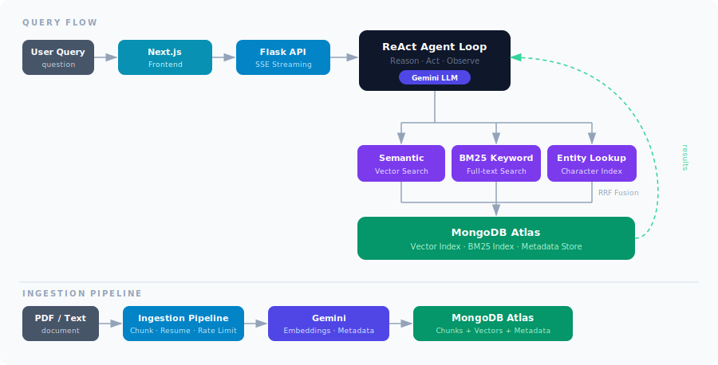

# Chronicle

An agentic RAG system built for long-form novel reasoning — answering complex questions about characters, plot, and narrative across hundreds of chapters.

---

## The Problem with Standard RAG on Novels

Most RAG implementations retrieve the top-k semantically similar text chunks and hand them to an LLM. This works well for short documents and factual lookups. It breaks down on long-form fiction.

Novels are structurally different. The same character appears across hundreds of chapters with shifting motivations, allegiances, and perspectives. A plot question may require connecting events separated by several hundred pages. POV shifts mean the same scene can be described from conflicting viewpoints. Pure vector similarity flattens all of this — returning chunks that sound related rather than chunks that are actually relevant.

Chronicle is built specifically to handle this. It treats document Q&A as a multi-step reasoning problem, not a single retrieval pass.

<p align="center">
  
</p>

---

## How Chronicle Solves It

### Agentic Reasoning over Search

Rather than a single retrieval pass, Chronicle uses a ReAct (Reason + Act) agent loop. The agent reads the query, decides which search strategy is most appropriate, observes the results, and iterates — running multiple targeted searches if the first result is insufficient. The agent's reasoning process streams to the UI in real time, so you can follow its chain of thought.

### Hybrid Search with Narrative Awareness

Chronicle combines three search mechanisms fused via Reciprocal Rank Fusion (RRF):

- **Semantic vector search** — captures meaning and paraphrase across chapters
- **BM25 keyword search** — exact name and term matching for character and location references
- **Character/entity lookup** — direct index into which chapters a character appears in, bypassing semantic distance entirely

This combination solves the core failure mode of pure vector search on fiction: a character's name may not appear in the semantically nearest chunk, but BM25 and entity lookup find it directly.

### Structure-Aware Ingestion

The ingestion pipeline does more than chunk and embed. For each segment of the document, it uses an LLM pass to extract structured metadata: chapter title, point-of-view character, characters present in the scene, and a brief AI-generated summary. This metadata is stored alongside the embeddings and used to filter and rank search results, grounding retrieval in the actual narrative structure of the book rather than raw text proximity.

The pipeline supports parallel and sequential processing, configurable rate limits, automatic stall detection, and mid-ingestion resume — so large novels (1000+ pages) can be ingested reliably without starting over on failure.

---

## Tech Stack

| Layer | Technology |
|---|---|
| Frontend | Next.js, React |
| Backend | Python, Flask (SSE streaming) |
| AI | Google Gemini — LLM reasoning and text embeddings |
| Database | MongoDB Atlas — vector search index and BM25 full-text index |

---

## Local Setup

### Prerequisites

- Node.js (v18+)
- Python 3.11+
- A [MongoDB Atlas](https://www.mongodb.com/atlas) cluster
- A [Google Gemini](https://ai.google.dev/) API key

### Environment Variables

Create a `.env` file in the project root:

```env
MONGO_URI=mongodb+srv://<user>:<password>@<cluster>
MONGO_DB_NAME=chronicle
GEMINI_API_KEY=<your-gemini-api-key>
```

### MongoDB Atlas Index Setup

Two indexes are required on the `vector` collection:

1. **Vector search index** named `vector_index` on the `embedding` field (cosine similarity, 1536 dimensions)
2. **Full-text search index** named `search_index` on the `text` field (BM25)

### Run the Backend

```bash
pip install -r requirements.txt
python api/index.py
```

The API server starts on `http://localhost:5000`.

### Run the Frontend

```bash
npm install
npm run dev
```

The app is available at `http://localhost:3000`.
